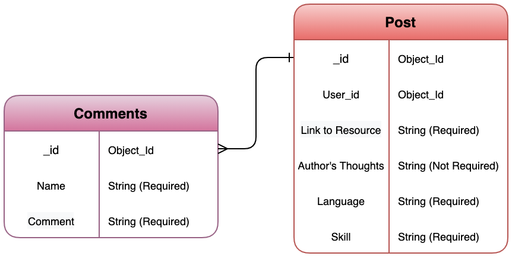

  <h1> ReSource Full </h1>
<h3><b>Designed & Executed By: Sam'an Khaliq</b></h3>
:triangular_ruler: :memo: :computer: :hourglass_flowing_sand:
 
  (Deployed Site Below)

---
<h3><b>:handshake: Introduction :handshake:</b></h3>

ReSource Full is a full-stack website, loosely inspired by Stack Overflow. You'd be hard-pressed to find anyone who works in tech who has never felt the bliss of finding the exact answer they were looking for on their website. If you're in tech, you also know that a lot of it is about independent research and study. I wanted to create a website that could help answer questions before they needed to become a post on Stack Overflow. A digital library of sorts that anyone who wants to learn a new skill in the tech space can go to find peer-endorsed resources, tried, tested, and shared by others who've already succeeded in the endeavor they've set out to conquer.

<h3><b>:calendar: Planning :calendar:</b></h3>
 

React Component Hierarchy:

 
 

Entity Relationship Diagram:

 
 

Technologies Used:

 
 
 

<a href='https://www.linkedin.com/in/saman-khaliq/' target='_blank'>LinkedIn</a> | <a href='https://www.samankhaliq.com/' target='_blank'>Portfolio
</a> | <a href='https://resource-full.herokuapp.com'>Deployed Site</a>

 

### Future Additions :thinking: :thought_balloon:

- [ ]  User authentification

- [ ]  Profile and background pictures for users

- [ ]  Post Reactions

- [ ]  Give users the option to report a post

- [ ]  Create a contact us for user suggestions

- [ ]  Create SOS posts that will function like Stack Overflow.

- [ ]  Dark Mode
